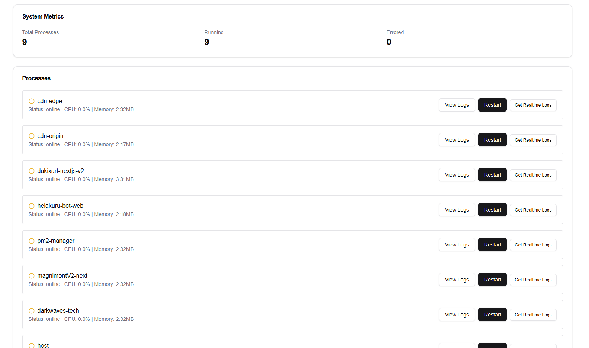

# PM2 Manager

PM2 Manager is a lightweight web-based tool for managing PM2 processes, providing an intuitive interface to monitor, restart, and manage your Node.js applications.

## Features

- **Process Monitoring**: View real-time information about your PM2 processes.
- **Management**: Start, stop, restart, and delete processes.
- **Logs**: Access logs directly from the interface.
- **Responsive UI**: Built with Tailwind CSS for a seamless experience across devices.

## Screenshot




## Technologies Used

- **Next.js**: Framework for server-side rendering and API routes.
- **TypeScript**: For robust and type-safe code.
- **Tailwind CSS**: For modern and responsive design.
- **PM2**: Process management for Node.js applications.

## Getting Started

### Prerequisites

- **Node.js** (v14 or later)
- **PM2** installed globally:  
  ```bash
  npm install -g pm2
  ```

### Installation

1. Clone the repository:
   ```bash
   git clone https://github.com/darkwaves-ofc/pm2-manager.git
   ```
2. Navigate to the project directory:
   ```bash
   cd pm2-manager
   ```
3. Install dependencies:
   ```bash
   npm install
   ```

### Running the Project

- Development mode:
  ```bash
  npm run dev
  ```
- Build for production:
  ```bash
  npm run build
  npm start
  ```

### Access the Application

- Open your browser and visit:
  ```
  http://localhost:3000
  ```

## Usage

1. Ensure PM2 is running on your server.
2. Use the web interface to manage processes:
   - Add new processes.
   - Monitor existing processes.
   - View and manage logs.

## Contributing

Contributions are welcome! Fork the repository, make your changes, and submit a pull request.

## License

This project is licensed under the MIT License.
